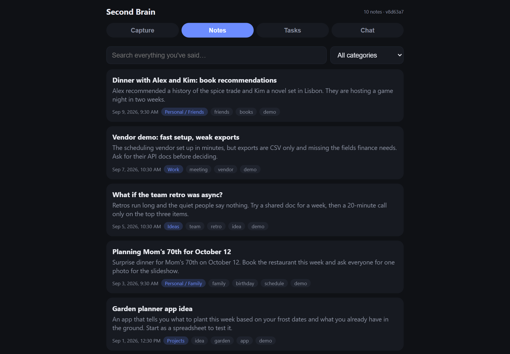
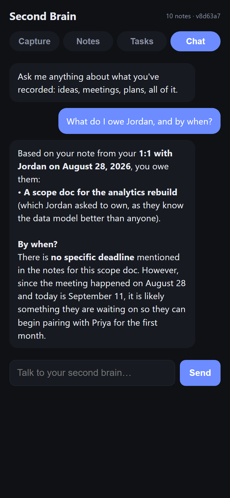

# Second Brain

Talk into your phone or upload a recorded voice file. Every note is transcribed, titled, summarized, filed into a category that
grows with you, and turned into action items. Then you can search everything you've ever said, or
ask it questions.

It runs on your own machine. It was built for one person's daily use, and it's shared here as a
template you can set up with an AI coding assistant: Codex, Cursor, Claude Code, or whichever you
use.

<p>
  
  
</p>

The screenshots show the fictional example notes that ship with the app (`npm run demo`).

## How it works

```
capture (phone mic / uploaded recording / pasted text / API)
   │
   ▼
transcribe      any Whisper-compatible service; long recordings split with ffmpeg
   │
   ▼
categorize      a model titles, summarizes, tags and files the note, pulls out action items,
   │            proposes a new category when nothing fits, and writes down what it learned
   ▼            about how you file things, so the next note is filed better
search + chat   full-text search over every note; a chat agent that searches before it answers
```

- **Capture is the hard part, so it's built to not lose audio.** Recording survives the screen
  turning off and the app being backgrounded, a failed upload waits on the phone and retries, and
  a truncated upload can be rebuilt. [docs/RELIABILITY.md](docs/RELIABILITY.md) has the real
  failures behind each of these.
- **The taxonomy is yours.** It starts with five categories. The model proposes new ones as your
  notes need them, and you can add your own filing rules in plain words.
- **Action items have state.** Every to-do pulled from a note is tracked as open, working, done or
  dropped, and re-filing a note never resets one you've finished.
- **Any model provider.** Anthropic, OpenAI, Gemini, or a local model through Ollama (or anything
  else that speaks OpenAI's API). Transcription is separate, so you can mix them.

## What it costs

Every model call and every transcription is logged with the tokens and audio minutes the provider
reported. `npm run costs` shows the total, per note and per model.

For scale: the original app, used heavily for a month (249 notes, about 2,070 minutes of audio), was
reconstructed from its own record at about $30, or roughly $0.12 a note. Transcription was the
largest single piece ($12.42), and filing notes with an Opus-class model was $11.58. That estimate
excludes chat which has been used minimally in the original app

A cheaper model cuts the filing cost even more. Set `CATEGORIZER_MODEL` in `.env` and compare with
`npm run costs`.

## Set it up

You need Node.js 22.5 or newer (the database is Node's built-in SQLite), ffmpeg for recordings over
about 25 minutes, and API keys for the providers you choose.

```bash
git clone <this repo>
cd second-brain-template
npm install
cp .env.example .env     # pick a provider and add its key
npm run check            # one short call to prove it answers
npm run demo             # optional: a few weeks of example notes
npm start                # http://127.0.0.1:3000
```

Or open the folder in your AI coding assistant and say **"set up my second brain."** It checks the
machine, sets up your provider, adds your own filing rules, gets it onto your phone, and schedules
backups. [AGENTS.md](AGENTS.md) is the script it follows, and you can follow it by hand.

With Docker instead: `cp .env.example .env`, fill it in, then `docker compose up -d`. Your data
lives in `./data`.

### Model providers

| `LLM_PROVIDER` | Key | Default model |
| --- | --- | --- |
| `anthropic` | `ANTHROPIC_API_KEY` | `claude-opus-5` |
| `openai` | `OPENAI_API_KEY` | `gpt-5.4-mini` |
| `gemini` | `GEMINI_API_KEY` | `gemini-3.5-flash` |
| `ollama` | none | `llama3.1` |

Set `CATEGORIZER_MODEL` and `CHAT_MODEL` to use others, and `LLM_BASE_URL` to point the OpenAI-style
providers at any compatible server. Transcription uses `OPENAI_API_KEY` unless you set
`TRANSCRIBE_API_KEY` and `TRANSCRIBE_BASE_URL`.

## On your phone

Open the app in Safari and choose Share > Add to Home Screen. It opens full screen with a record
button: open, talk, done.

To reach it away from home, the simplest private route is [Tailscale](https://tailscale.com) on the
computer and the phone (AGENTS.md step 6). For the public internet, set `AUTH_TOKEN` and put it
behind HTTPS. Enter that token in the app?s Unlock form. The browser uses an HttpOnly
session cookie for notes, uploads, and playback; sign in again after a server restart.
Recordings waiting for authentication stay queued on the device.

**Long recordings from Voice Memos:** make an iOS Shortcut named "Send to Second Brain" with *Show in
Share Sheet* on, accepting files, and one action: *Get Contents of URL* with URL
`https://<your-server>/api/ingest`, method POST, request body Form, field `audio` (type File) set to
Shortcut Input, plus the header `Authorization: Bearer <token>` if you set `AUTH_TOKEN`. Then share
any recording to it.

## Your own filing rules

Write them in `data/conventions.md`, one per line, in plain words:

```
Anything about the garden goes under Projects / Garden.
Tag every note that mentions a client with client:<name>.
```

The next note uses them. No restart needed.

## API

Every route is under `/api`. With `AUTH_TOKEN` set, send `Authorization: Bearer <token>`.

| Route | What it does |
| --- | --- |
| `POST /api/ingest` | Multipart with an `audio` file, or JSON `{"text": "..."}`. Returns the note; processing runs in the background. |
| `GET /api/notes` | List notes. Query: `category`, `status`, `limit`, `offset`. |
| `GET /api/notes/search?q=` | Full-text search over transcripts, titles and summaries. Query: `q`, `category`, `limit`, `offset`. |
| `GET /api/notes/:id` | One note, with its full transcript. |
| `GET /api/notes/:id/audio` | The original recording (410 once pruned; the transcript is kept). |
| `POST /api/notes/:id/process` | Run the pipeline again, for example after adding a key. |
| `DELETE /api/notes/:id` | Delete a note and its audio. |
| `GET /api/tasks` | Action items. Query: `state` (open, working, done, dropped), `category`, `tag`. |
| `PATCH /api/tasks/:id` | JSON `{"state": "done", "note": "..."}`. |
| `GET /api/categories` | The taxonomy, as a list and as a tree. |
| `POST /api/chat` | JSON `{"messages": [{"role": "user", "content": "..."}]}` returns `{"reply": "..."}`. |
| `GET /api/usage?days=30` | Model and transcription usage and estimated cost. |
| `GET /api/health` | Note counts, what's configured, and the front-end version. |

## Keeping it safe

- **Backups:** `npm run backup` writes a verified snapshot to `data/backups/` (and to
  `BACKUP_OFFSITE_DIR` if set). `node scripts/verify_backups.mjs` re-opens them to prove they
  restore. Schedule both nightly.
- **Disk:** `node scripts/prune_audio.mjs` deletes audio older than `AUDIO_RETENTION_DAYS` (default
  180) and keeps every transcript.
- **Tests:** `npm test` runs everything offline against local stubs, so it never calls a paid API.

## Privacy

- Your notes, recordings and database live in `data/` on your machine, which git ignores and the
  Docker build excludes.
- Audio goes to the transcription service you configure, and transcripts go to the model provider
  you configure. Nothing else leaves the machine.
- Without `AUTH_TOKEN`, anyone who can reach the server can read your notes, so it listens on
  127.0.0.1 unless you change `HOST`.

## License

MIT. See [LICENSE](LICENSE).
